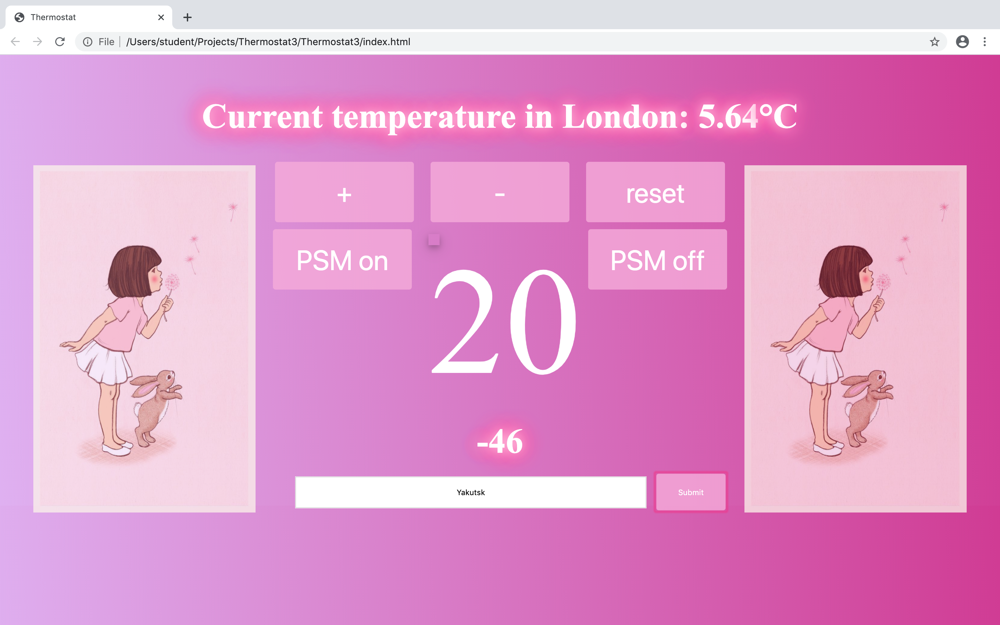

```
**Thermostat**

**Week 5 project to build a simple thermostat**

I test drove the development of the thermostat using the testing framework Jasmine.
The interactive aspect of the app was created with JavaScript and jQuery.

```

```

**User Stories**

As a parent,
So I can check my thermostat is working,
I want my thermostat to start at 20 degrees celsius

As a parent,
So my child can be comfortable in their room,
I want to be able to increase and decrease the temperature 

As a parent,
So I can make sure my home doesn't get too cold,
I want to ensure that the temperature doesn't fall below 10 degrees celsius

As a parent,
So I can make sure that my home doesn't get too hot,
I want to ensure that the temperature doesn't rise above 32 degrees celsius

As a parent,
So I can monitor my family's energy usage,
I want the maximum temp to rise to only 25 degrees celsius when PSM (Power Saving Mode) is on

As an environmentally conscious individual,
So I can try to reduce my family's carbon footprint,
I want to ensure that PSM (Power Saving Mode) is on by default

As a curious invidivual,
So I can check the current temperature in London,
I would like to see the current temperature displayed

As a curious individual,
So I can check the current temperature in cities around the world,
I would like to be able to enter a city and see the city's current temperature displayed

As a fan of Belle and Boo,
So I can feel a sense of nostalgia when I look at my thermostat,
I would like to be able to see a picture of Belle and Boo on the thermostat 

```

```



```